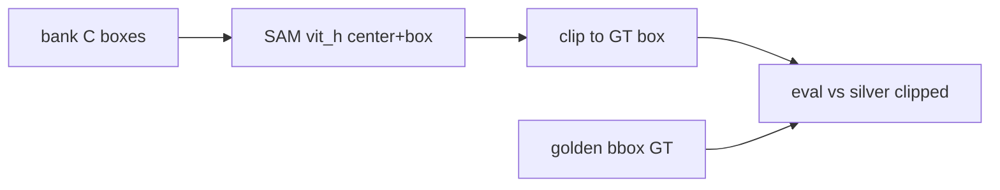
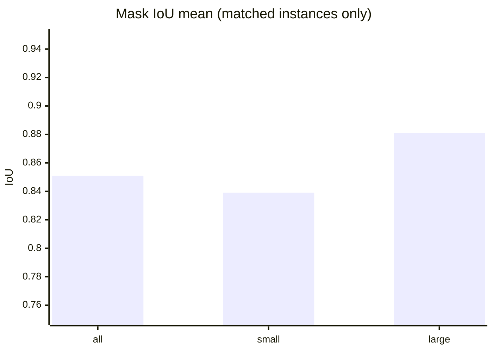
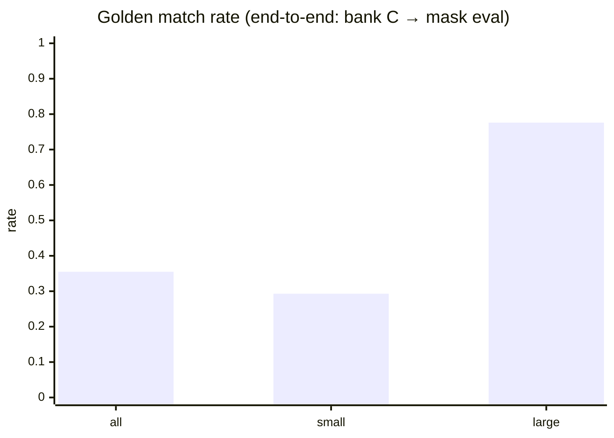

# exp-002 RGB instance-seg backend ceiling (H3 v1.1)

**Queue:** [[experiments/exp-001-per-layer-baselines]] (H1) → **exp-002 / H3 (this page)** → [[experiments/exp-003-merge-fusion-v1]] (H2).  
**Gate:** ADR-002 — sequence approved (see [[project/decisions]]). **Start after exp-001a closure** (bbox bank + golden protocol frozen). exp-001b (LM/CHM) may run in parallel; not required for H3 RGB mask bake-off.  
**Status (2026-10-09):** **H3 v1.1 protocol locked**; **eval harness + sanity OK**; **C1 end-to-end scored** on Workbench (`smoke_c1_bank_c_001`, SAM **vit_h**, bank C, 5 tiles). **Next:** prompt ablations **C2/C3**; optional A/B backends; formal recommendation after comparisons.

## Executive summary (for the board)

exp-001 answered **“where are the trees?”** (bounding boxes) on a fixed young-forest test area: we combine a **large-tree** model and a **small-tree** specialist (**bank C**). exp-002 answers the next product question: **“what is the shape of each crown?”** (instance masks). We compare **how** we generate those masks from the same aerial photos — mainly **AI that follows our detection boxes** (SAM-family), and optionally other published crown-segmentation tools — and score them against a **silver** reference (AI masks clipped to human boxes, not a second human paint job on every pixel). We also test whether mask quality depends on **which boxes we use as hints** (full product merge vs large-only vs small-only). **Outcome for leadership:** either a clear **recommended mask pipeline** before we invest in advanced merge (exp-003), or a **stop signal** if masks are too weak — then we improve labels/data instead of building fusion on shaky crowns. We are **not** claiming closed dense-canopy forest behaviour on this test set (same limitation as exp-001).

## Hypothesis

#### For the board

We test whether **crown outline quality** differs enough between segmentation approaches — and between **which detection boxes we feed in** — to justify a single product choice before we merge detections using masks (exp-003). exp-001 already showed that **finding** small trees matters; H3 asks whether **outlining** them is good enough to bet the next engineering step on.

**H3 v1.1 (active):**

On the **same hold-out as H1 v1.1** — **small-sparse R-class** crowns on `kaxen_197_1` (not closed-canopy dense) — with **silver clipped** masks as the mask reference, differences between **runnable** RGB instance-seg backends and between **box-prompt policies** inherited from exp-001a are **systematic enough** (especially on **small** size bin) that we can recommend one **`mask_backend` + `prompt_policy`** for [[experiments/exp-003-merge-fusion-v1]]. If backends and prompt variants are similarly weak or near-tie, **do not** proceed to mask-aware fusion as the primary bet (data / label program instead).

**H3 v1.0 (superseded):** On **dense** tiles, ECSeg vs Tier A (StarDist / SAM2-prompted) mask ceilings differ enough that backend choice changes merge ROI **more than adding another bbox detector**. *Misaligned with exp-001a:* golden is small-sparse; H1 already fixed the bbox story (multi-scale bank **C** = `svk_full@800` ∪ `FT@400`). Dense-ITD and open/dense structural split remain **deferred** until overlap GT exists.

#### Takeaway

H3 is **mask + prompt policy**, on the **same young-forest test tiles** as H1 — not another round of “which bbox model wins.” Success = one written recommendation for exp-003 (merge); failure = all options similarly bad → invest in labels, not mask-merge.

## Motivation

#### For the board

Production vision moves from **points/boxes** toward **crown shapes** for inventory, overlap, and merge quality. Before we lock engineering on one vendor or model family, we run a **controlled comparison** on the same images and references H1 already uses — so board and product see one story, not three incompatible benchmarks.

- Pick a **mask source** for exp-003 (merge) without assuming [[methods/edgecrafter-ecseg]] is the default ([[project/research-tree-detection-ensemble]])
- H1 showed **FN on small trees** dominates bbox error on this hold-out; mask quality may hinge on **which boxes prompt** SAM-family (bank C vs ablations), not only on seg model family
- Silver reference: clipped SAM pseudo-GT (not raw SAM oracle as a detector ceiling — see exp-001 archive note)
- Literature context for dense ITD remains useful for **future** tiles: [[concepts/literature-map-dense-itd]], [[concepts/dense-stand-detection]] — **out of scope** for this H3 iteration
- Feeds [[experiments/exp-003-merge-fusion-v1]] Variant B (mask-aware merge)

#### Takeaway

Motivation is **de-risk the next merge step** — choose crown outlines with evidence, aligned with the ensemble roadmap — not a parallel science project.

## Pseudocode

#### For the board

In plain terms: (1) use the **same five test images** and **silver** crown references as agreed in H1; (2) draw crowns with several **segmentation methods**, using our **detection boxes** as guides where needed; (3) score **outline accuracy**, especially on **small** trees; (4) pick one method + one **box-hint policy** for the follow-on merge experiment — or stop if nothing is good enough.

**Inputs:** same RGB tiles as exp-001; **mask GT** = silver clipped COCO; **box prompts** from exp-001a preds (primary: bank C; ablations: svk@800-only, FT@400-only)

**Outputs:** per-backend + per-prompt metric tables; `recommended_mask_backend` + `recommended_prompt_policy` for exp-003

**Parameters:** SAM/SAM2 prompt mode (box); ECSeg zero-/few-shot settings (TBD); post-process (TBD); resolution = match ortho GSD

```text
1. Freeze tiles, silver clipped GT, and H1 prompt COCO paths (no LM/CHM fusion).
2. Backend C (mandatory sprint): SAM2- or SAM-prompted crowns from detector boxes.
   - C1 prompts: bank C merged preds (exp-001a product path)
   - C2 prompts: svk_full@800 only
   - C3 prompts: Round1 FT@400 only
3. Backend A (optional if env ready): ECSeg zero-/few-shot ([[methods/edgecrafter-ecseg]]).
4. Backend B (optional): StarDist-style — if runnable; else Gap (skip).
5. Score mask/instance metrics vs silver clipped; stratify small bin (same thresholds as H1).
6. Secondary: regression check vs golden bbox GT where useful (qualitative + optional AP).
7. Recommend mask_backend + prompt_policy for exp-003 (or kill → data program).
```

### Prerequisites

- **exp-001a closed** — golden bbox protocol + bank C reference preds documented
- Shared paths: engineer manifest `research/exp-002/manifest.yaml` in coding module
- At least **two** comparable conditions (e.g. C1 vs C2, or C + A); if only one backend runs, document and **iterate** (do not fake A/B)

### Human gate (before GPU)

#### For the board

Before significant GPU cost, we agree the **minimum credible comparison**: product boxes + SAM-family (**C1**) and scoring vs silver reference. Extra tools (ECSeg, StarDist) and box ablations (C2/C3) are prioritized in the table below — leadership can trim optional tiers if budget is tight.

| Tier | Item |
|------|------|
| **Mandatory** | SAM-family prompted run with **bank C** boxes (C1) |
| **Mandatory** | Eval harness vs **silver clipped** + small-bin stratification |
| **Strongly recommended** | Prompt ablations C2, C3 (link mask errors to H1 bbox path) |
| **Optional** | ECSeg (A), StarDist (B) — skip with Gaps if no weights/recipe |

### Gaps

- StarDist / TreePseCo train recipes and weights outside vault
- Numeric mask metric formulas — provisional until ADR-001; record definitions in Results
- Closed-canopy **dense** eval — requires new GT/tiles; not this sprint

#### Takeaway

We will not run a fake “competition” with only one tool — minimum **two** comparable conditions (e.g. product boxes vs baseline-only boxes). Optional tools (ECSeg, StarDist) are **nice-to-have**, not blockers for a first verdict on SAM + bank C.

## Evaluation protocol

#### For the board

Scores answer: **“How well does the predicted crown match our silver reference?”** — reported **separately for small and large trees** (same size rule as exp-001), so we do not hide poor small-crown outlines inside an average. Human boxes remain a **sanity check**, not the primary mask score. This is the **same test geography** as exp-001; results are **not** proof for closed dense stands.

- **Primary regime:** small-sparse R-class on `kaxen_197_1` (align with H1 v1.1)
- **Primary mask reference:** silver clipped (`instances_tree_sam_clipped.json`)
- **Stratification:** size bins same as exp-001 (small = bbox area &lt; 0.1% of image)
- **Secondary:** golden bbox GT for regression / failure taxonomy overlays
- **Deferred:** dense-ITD split, open structural split — same data gap as H1

### Data / code (engineer repo)

Base: `conifervision-ai-train/`. **Silver** = SAM masks clipped to human boxes; images symlink to golden.

- **Mask reference (primary):** `research/annotations/silver/kaxen_197_1/annotations/instances_tree_sam_clipped.json`
- **Human bbox GT (secondary):** `research/annotations/golden/kaxen_197_1/annotations/instances_tree.json`
- **Images (5 tiles):** `research/annotations/golden/kaxen_197_1/images`
- **Box prompts — product path (C1):** `research/exp-001/results/sahi_bank_002/preds/bank_C.json`
- **Manifest / notes:** `research/exp-002/manifest.yaml`, `research/exp-002/notes.md`

#### Takeaway

When reading future tables, prioritise **small-tree mask quality** and **under/over-segmentation** (merged vs split crowns) — the errors that would break inventory and merge — not a single opaque score.

## Success criteria

#### For the board

**Success** means leadership can approve **one mask pipeline** (tool + which detection hints to use) for the merge experiment, with example failure images on file. **Near-tie** is acceptable if we document trade-offs (speed, cost, licence).

- Clear ranking or documented near-tie among **runnable** backends **and** among prompt policies on silver clipped
- Written **`recommended_mask_backend`** + **`recommended_prompt_policy`** for exp-002
- Failure examples (under-seg on small crowns, spill, duplicate instances)

#### Takeaway

Success is a **decision-ready recommendation**, not “we tried three papers.”

## Kill criteria

#### For the board

**Kill** means: after fair effort, **no** segmentation option is clearly usable on silver reference (especially small crowns) — so we **pause mask-based merge** as the main product bet and fund **better ground truth / labels** first. That is a **responsible stop**, not a failed quarter.

- All backends and prompt variants in budget yield similarly weak / unusable masks on silver clipped (especially small bin) → prioritize gold/pseudo label program; **do not** proceed to exp-003 mask-aware fusion as primary bet

#### Takeaway

Kill criteria **not evaluated yet** (experiment not run). If triggered later, communicate: **boxes may be good enough; crowns are not — fix data before fusion.**

## Setup

#### For the board

**In this experiment:** only **RGB crown segmentation** (no height map or peak fusion). Detection boxes from exp-001 are **inputs** to “draw the crown inside this rectangle,” not a new detection bake-off.

RGB instance-segmentation backends only; detector boxes as **inputs** to prompted paths, not fusion of LM/CHM layers.

#### Takeaway

Setup keeps H3 **narrow** — outline quality only — so results map cleanly to exp-003.

## Runs

#### For the board

| What we call it | Plain English | Priority |
|-----------------|---------------|----------|
| **C1** | Crowns from AI **following boxes from product merge (bank C)** | **Must run first** |
| **C2** | Same AI, but boxes from **large-tree-only** model | Recommended — shows if merge helps outlines |
| **C3** | Same AI, but boxes from **small-tree specialist only** | Recommended |
| **A** | Published **ECSeg**-style tool (zero/few-shot) | Optional if environment ready |
| **B** | **StarDist**-style crown model | Optional; skip if no weights |

| Run | Config / baseline | Notes |
|-----|-------------------|-------|
| C1 | SAM-family + **bank C** box prompts | Product-aligned; **mandatory** |
| C2 | SAM-family + svk@800 only | Prompt ablation |
| C3 | SAM-family + FT@400 only | Small-expert prompt ablation |
| A | ECSeg | Optional; zero-/few-shot |
| B | StarDist-style | Optional; skip if not runnable |

#### Takeaway

The run table is the **audit trail** for which tool and which box hints were used — essential when the board asks “what did we actually ship to the comparison?”

## Results

#### For the board

First scored runs (2026-10-09): we can **draw crowns** from product **bank C** boxes with SAM and score them against **silver** on the same five tiles as exp-001 (**2534** golden trees). Two numbers matter:

1. **End-to-end coverage** — did bank C leave a box we could segment? (**~35%** of golden trees had a matching prediction.)
2. **Outline quality where both exist** — when a pred box matched golden, mask vs silver was **strong** (**~85%** average overlap).

Low coverage is mostly the **detection** story from exp-001 (missed small trees), not “SAM failed on every crown.” **Kill criteria not triggered** on mask quality for matched cases; we still need **C2/C3** before locking prompt policy for exp-003.

Protocol: golden-indexed eval; bbox match IoU **0.5**; size small = bbox area **&lt; 0.1%** of image (same as H1). Primary ref = silver clipped. Code: `research/exp-002/eval_seg_masks.py`.



### Harness sanity (no GPU seg)

| Run ID | mask_iou_mean | match_rate_ref | Notes |
|--------|--------------:|---------------:|-------|
| `sanity_silver_self_001` | **1.0** | **1.0** | Silver pred = silver ref — proves metric code |

### C1 — SAM prompted + bank C (product path)

| Field | Value |
|-------|-------|
| **run_id** | `smoke_c1_bank_c_001` |
| **When** | 2026-10-09 (Workbench `ai-train-deimv2`, env `deimv2_311`) |
| **Backend** | SAM (`segment_anything`), **vit_h**, prompt `center+box` |
| **Box prompts** | `exp-001/results/sahi_bank_002/preds/bank_C.json` (**n_pred = 1200** on 5 tiles) |
| **code git_sha** | `e8fc202` |
| **Artifacts** | `research/exp-002/results/smoke_c1_bank_c_001/` (COCO, overlays, `eval/results.json`) |

#### Mask metrics vs silver (golden-indexed)

| Split | n_ref (golden) | match_rate_ref | mask_iou_mean | mask_iou_median | low_mask_iou_rate (&lt;0.5) |
|-------|---------------:|---------------:|--------------:|----------------:|----------------------------:|
| **all** | 2534 | **0.355** | **0.851** | 0.878 | **0.002** |
| **small** | 2208 | **0.293** | **0.839** | 0.868 | 0.003 |
| **large** | 326 | **0.776** | **0.881** | 0.912 | 0.0 |

| Diagnostic | Count | Interpretation |
|------------|------:|----------------|
| Golden with **no** matching pred (FN) | **1634** | Mostly **missing bank C box** — same small-tree gap as H1 |
| Pred **no** golden match (FP) | **300** | Extra detections segmented anyway |
| Pred matched (used for mask IoU) | **900** | **75%** of preds align to a golden tree |





#### Clip step (SAM raw → product box)

On **1200** bank-C instances: clip to GT box **reduced spill outside box** (mean fraction outside box **0.147 → 0.017**); mask–box IoU vs GT **0.679 → 0.776** mean. Instances with mask–box IoU &lt; 0.5: **123 → 45** after clip. Report: `…/smoke_c1_bank_c_001/clip_report.json`.

#### Engineer commands (replay)

```bash
cd research/exp-002
./run_eval_sanity.sh
export SAM_CHECKPOINT=/path/to/sam_vit_h_4b8939.pth
export SAM_MODEL_TYPE=vit_h DEVICE=cuda
./run_smoke_c1.sh   # RUN_TAG defaults to smoke_c1_bank_c_001
```

### Results backlog (not run yet)

| Run | mask_iou_mean | match_rate_ref | Status |
|-----|--------------:|---------------:|--------|
| **C2** svk@800 boxes only | — | — | pending |
| **C3** FT@400 boxes only | — | — | pending |
| **A** ECSeg | — | — | optional |
| **B** StarDist | — | — | optional |

#### Takeaway

**Mask outlines look usable where we have a product box** (high IoU vs silver, rare catastrophic mask failures). **We cannot yet recommend prompt policy** — only C1 is scored. Leadership should read **match_rate_ref** as “detection + segmentation pipeline,” not pure seg quality.

### Return package (wiki sync)

```text
exp_id: exp-002
hypothesis: H3
code_repo: conifervision-ai-train
code_git_sha: e8fc202
entrypoints: research/exp-002/eval_seg_masks.py, run_eval_sanity.sh, run_smoke_c1.sh
commands: see C1 block above
gcs_results: []
mlflow_run_ids: []
metrics:
  sanity_silver_self_001: { mask_iou_mean: 1.0, match_rate_ref: 1.0 }
  smoke_c1_bank_c_001: { mask_iou_mean: 0.851, match_rate_ref: 0.355, mask_iou_mean_small: 0.839, mask_iou_mean_large: 0.881 }
split_notes: small-sparse R-class kaxen_197_1; golden-indexed; IoU match 0.5
conclusion: iterate
kill_triggered: no
recommended_mask_backend: sam_prompted (provisional — only C1 run)
recommended_prompt_policy: C1_bank_c (provisional — C2/C3 pending)
```

## Conclusion

<!-- iterate -->

#### For the board

**Verdict: iterate (2026-10-09).** The **C1 product path works technically**: SAM crowns on **bank C** boxes score **~85%** mask overlap vs silver when a golden tree was matched; catastrophic mask errors are **rare**. **Not ready to accept** as final exp-003 package: we have **not** compared **C2/C3** (does merge help outlines vs large-only / small-only hints?), and **~65%** of golden trees still have **no** pred box in this end-to-end view — dominated by H1 small-tree recall, not mask backend failure.

| Verdict | Meaning for leadership |
|---------|-------------------------|
| **accept** | One mask pipeline recommended → proceed to exp-003 mask-aware merge with that choice |
| **iterate** | **Current** — C1 scored; run C2/C3 (+ optional A/B) then decide |
| **reject** | Masks not usable on reference → **data/label program**, not mask-merge as primary bet |

**Kill criteria:** **not triggered** (matched-mask quality is strong; experiment is not “all backends weak”).

#### Takeaway

**Proceed with H3 comparisons**, not with exp-003 mask-merge as fully decided. Boxes remain the bottleneck for **coverage**; outlines look **good enough to keep testing** on matched trees.

## Handoff to coding module

#### For the board

Engineering delivers **numbers, recommendation id, and example images** back into this wiki page; no model weights stored in the research vault. **Human gate** before exp-003 spend.

- Wiki: this page (H3 v1.1). Engineer: `conifervision-ai-train/research/exp-002/notes.md` + `manifest.yaml`
- Return: Results table + `recommended_mask_backend` + `recommended_prompt_policy` + failure examples
- No weights committed to this vault
- After conclusion: human gate before exp-003

#### Takeaway

Handoff = **decision package** for product and merge experiment owners, not a code dump.

## Related

- [[experiments/exp-001-per-layer-baselines]]
- [[experiments/exp-003-merge-fusion-v1]]
- [[project/research-tree-detection-ensemble]]
- [[project/hypothesis-validation-loop]]
- [[concepts/literature-map-dense-itd]]
- [[concepts/dense-stand-detection]]
- [[methods/edgecrafter-ecseg]]
- [[methods/merge-detections]]
