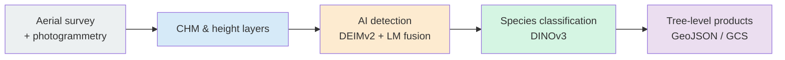
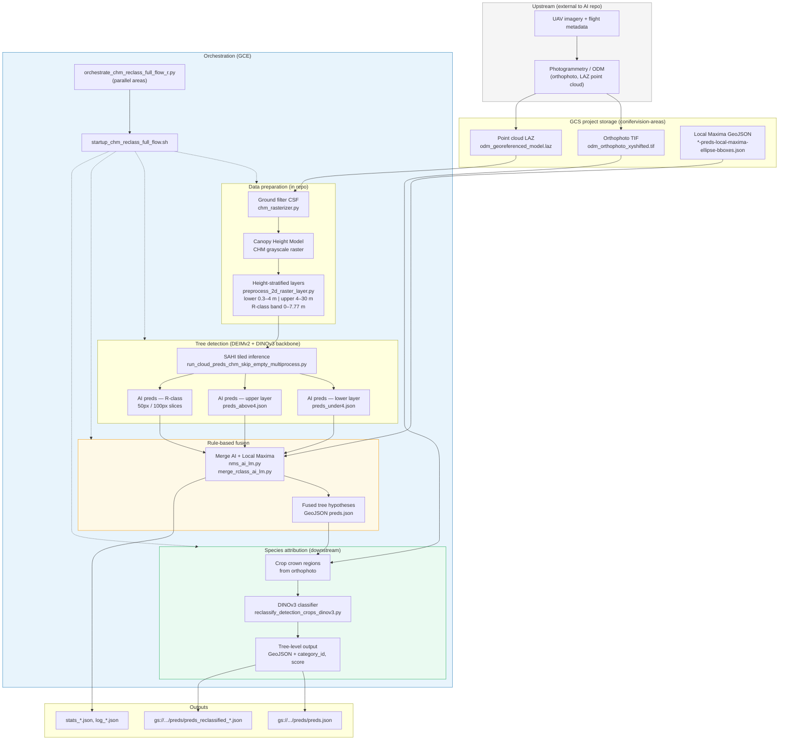
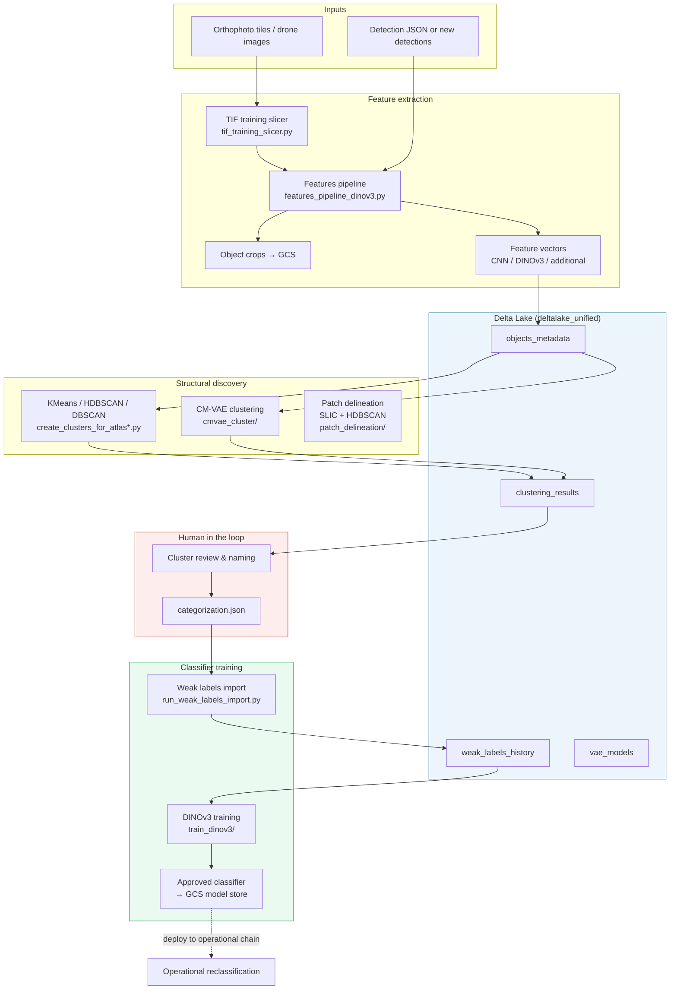

# Forest area analysis pipeline (AREA)

**Status:** reference description — update whenever production methodology changes. Lint compares this page against code and `methods/` pages.

Production methodology is separated from the research north star in [[project/research-tree-detection-ensemble]].

## Operational flow (current)

Per **AREA**, the production chain runs **detect → fuse → classify**. Detection is **2D on terrain-normalised CHM rasters** derived from photogrammetric point clouds — not learned 3D point-cloud detection.

### Overview (5 steps)

### End-to-end diagram (operational)

Full processing chain per AREA — upstream photogrammetry, GCS inputs, in-repo prep/detection/fusion/classification, orchestration, and outputs. Source: verified against production repo (`raw/assets/PROCESSING_CHAIN_DIAGRAM.md`).

### Stages

1. **Inputs** — orthophoto, photogrammetric LAZ, and precomputed local-maxima GeoJSON in GCS per AREA.
2. **CHM prep** — CSF ground filtering, CHM rasterisation, height-stratified layers ([[methods/chm-detection]]).
3. **Detection** — DEIMv2 + SAHI on CHM tiles per height band; local maxima run in parallel ([[methods/deimv2-canopy]], [[methods/local-maxima]]).
4. **Fusion** — rule-based merge of AI predictions and local maxima ([[methods/merge-detections]]).
5. **Classification** — DINOv3 on orthophoto crops mapped from fused detection boxes ([[methods/dinov3-classification]]).

Orchestration: `startup_chm_reclass_full_flow.sh` with multi-area Python orchestrator on GCE.

## ML / R&D track (separate)

Model improvement runs as a **batch lifecycle**, not inside the per-AREA operational chain:

features → Delta Lake → clustering / weak labels → DINOv3 training → approved model deploy back to operational reclassification.

Clustering and weak-label workflows support classifier training; they are **not** part of the operational detect→fuse→classify sequence.

## Not in production

See [[project/research-tree-detection-ensemble]] for the experimental program:

- RGB instance segmentation ensemble and mask-aware fusion (dense stands)
- LiDAR-assisted co-registration (external / development target)
- Automated analysis-type routing

**Literature (not in production):** [[concepts/pseudo-tree-crown]] from [[sources/miao-zhang-2024-ptc-uav-species]] — optional 3D-style crown reprojection before CNN input; tested with ResNet50 on UAV orthophoto patches, not DINOv3.

## External integrations

- Operational data and labels: **Delta Lake** (outside this repo) — the wiki links metrics and versions; it does not duplicate tables.

## Methods (wiki)

| Stage | Wiki page |
|-------|-----------|
| Local maxima | [[methods/local-maxima]] |
| CHM + detection | [[methods/chm-detection]] |
| DEIMv2 | [[methods/deimv2-canopy]] |
| Merge | [[methods/merge-detections]] |
| DINOv3 | [[methods/dinov3-classification]] |
