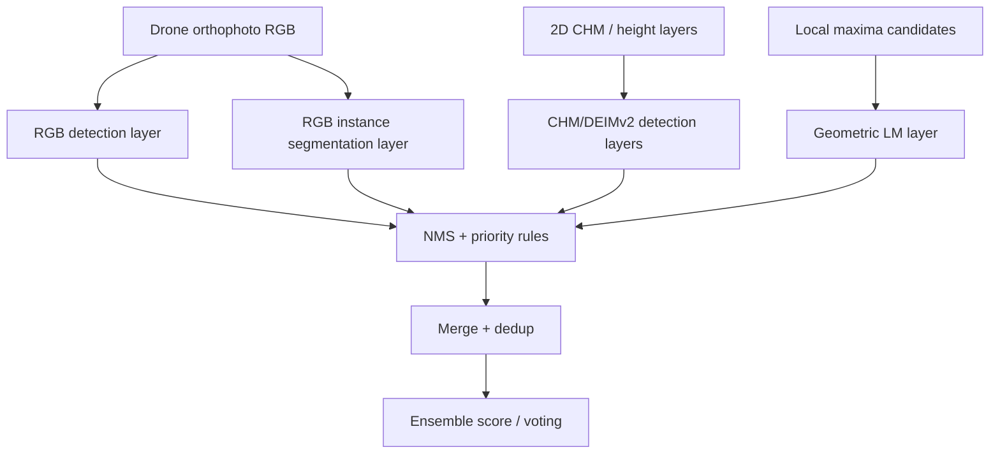

# Tree detection ensemble — research program

This document describes a *research program* to develop an ensemble for robust tree detection across varying tree sizes and dense stands (before clearing). It is intentionally separated from the production pipeline description in `project/pipeline-overview.md`.

## 0. Separation of concerns: production vs research

- `project/pipeline-overview.md` is the production AREA pipeline (what works today).
- `project/research-tree-detection-ensemble.md` is the experimental north star (what we are trying to improve).
- Decisions and contradictions live in `project/decisions.md` and can be checked via `make okf-lint`.

## 1. Ensemble decomposition (layers → fusion)

In production we already have the *geometry + CHM + DEIMv2* path. The research north star adds RGB-derived detection/segmentation and defines fusion rules that remain stable in dense conditions.

### 1.1 Inputs

- Drone orthophoto RGB
- 2D CHM / height layers
- Geometric surface / local maxima candidates

### 1.2 Detection layers

The ensemble is built as modular layers:

1. **Geometric layer (Local maxima)**: local-maximum filtering on 3D surface / CHM-derived height.
2. **CHM layer (DEIMv2)**: detection on multiple CHM height layers (small vs large trees).
3. **RGB detection layer** (baseline): RGB-driven object detection (DEIMv2/ECDet-like).
4. **RGB instance segmentation layer** (main ROI): instance segmentation to improve separation in dense stands.

### 1.3 Fusion (NMS / priority rules / ensemble voting)

Fusion is where most dense-stand improvements will come from:

## 2. EdgeCrafter integration (where it fits)

EdgeCrafter (Intellindust-AI-Lab) is a natural next step after your DINOv3/DEIMv2 ecosystem:

- It provides a unified compact framework with **teacher distillation** from DINOv3.
- It offers **ECDet** (bbox) and **ECSeg** (instance segmentation) from the same backbone.
- That directly maps to the research layers: RGB detection + RGB instance segmentation.

### 2.1 Recommended model priorities for ensemble building

1. **DEIMv2 (existing)** — keep as baseline for CHM detection.
2. **ECSeg** — instance segmentation is the key to dense-stand separation.
3. **ECDet** — bbox baseline/comparator for RGB-only path.
4. **Merge/NMS** — largest ROI for stable fusion across dense scenarios.

### 2.2 Wiki plan

- First: ingest EdgeCrafter paper(s) into `conifervision/sources/` (status `draft` until reviewed).
- Then: create/prepare:
  - `methods/edgecrafter-ecdet.md` (draft)
  - `methods/edgecrafter-ecseg.md` (draft)
- Keep fusion logic in `methods/merge-detections.md` with explicit assumptions and alignment to production.

## 3. Dense stands (before clearing) — dedicated research thread

Dense stands behave differently than sparse stands:

- Boxes overlap → vanilla NMS can suppress true trees.
- Segmentation needs correct **instance boundaries**, not just detection centers.
- CHM may be flat / insufficiently separable → the geometric layer (LM) can lose discriminatory power.

Create a dedicated concept page:

- `concepts/dense-stand-detection.md`

It should define:

- evaluation stratification: **open vs dense**
- metrics by size bin (small vs large trees)
- dense-specific error modes: duplicates, under-segmentation, boundary IoU degradation
- the working hypothesis: segmentation-first fusion improves dense separation vs bbox-only voting

## 4. Data strategy: annotation scarcity (gold + pseudo + curation + targeted synthetic)

You explicitly need a strategy for limited human annotations. The most robust approach is a hybrid:

### 4.1 Phased data stack

| Phase | What | Goal |
|-------|------|------|
| A | ~500–2000 human-annotated trees (stratified: small/large + dense/sparse) | Gold eval + fine-tuning anchors |
| B | Pseudo-labels from the current teacher ensemble (e.g., DEIMv2 + ECSeg zero/few-shot) with confidence filtering | Expand training pool |
| C | Vo-style curation (hierarchical k-means on DINOv3 embeddings) | Choose diverse crops for the next manual annotation wave |
| D | Targeted synthetic objects / augmentations | Add rare/edge cases; avoid making synthetic the main label source |

### 4.2 Why hybrid beats pure synthetic or pure SSL

- Procedural crowns pasted into orthophotos rarely reproduce shadows, species/terrain variability, and sensor artifacts.
- In dense stands, the dominant failure mode is **topology** (connected crowns), not only appearance.
- Therefore synthetic is best as **augmentation and edge-case coverage**, not as the primary supervision source.

### 4.3 Teacher–student practice (recommended)

1. Run the ensemble (DEIMv2 + ECSeg + CHM/LM) to produce candidate pseudo boxes/masks.
2. Keep pseudo-labels where at least two layers **agree** or where disagreement has a known, manageable error mode.
3. Manually correct only disagreement samples (active learning).
4. Retrain the student (primarily ECSeg) on gold + high-quality pseudo.

## 5. Research workflow in this repo (how to keep the wiki disciplined)

Hypothesis unit and handoff to the coding/GPU module: [[project/hypothesis-validation-loop]]. Agent operation: **Hypothesis** in `AGENTS.md`.

This repo already defines a solid operational workflow in `AGENTS.md`:

| Operation | When | Output |
|----------|------|--------|
| Ingest | New paper / dataset / annotation protocol update | `conifervision/sources/` + update `methods/` |
| Hypothesis | Propose/refine testable ideas toward this program | candidates in chat → `experiments/exp-NNN-*.md` + optional ADR |
| Experiment | After each ML run or evaluation batch | update `conifervision/experiments/exp-NNN-*.md` Results/Conclusion |
| ADR | Team decisions (“ECSeg before ECDet”, fusion strategy change, metric changes) | entry in `conifervision/project/decisions.md` |
| Lint | Periodic consistency checks | `make okf-lint` |
| Query | Synthesis questions | answer + optionally new `concepts/` page |

### What not to do here

- Do not store model weights, large datasets, or Delta Lake parquet files in this repo.
- Training scripts and infrastructure belong in the dedicated code repo (until `conifervision/project/code-repo-integration.md` is marked done).

## 6. Roadmap (4 phases)

### Phase 0 — Protocol (≈ 2 weeks)

- Create `evaluation-protocol-detection.md`:
  - metrics (per size bin and open/dense split)
  - split definition for AREA
  - dense/open tag definition (how density is measured)
  - the primary success criteria for the ensemble
- Add `ADR-001` to `project/decisions.md` defining “success” for v1.

### Phase 1 — Baselines per layer (≈ 4–6 weeks)

- Run separate experiments (no fusion yet):
  - DEIMv2 detection on CHM layers
  - RGB detection baseline
  - ECSeg zero-shot / few-shot with current checkpoint or adapters
  - LM + CHM merge baseline (existing)
- Output: per-layer ceiling and error taxonomy.

### Phase 2 — Fusion (≈ 3–4 weeks)

- Decide and implement fusion strategy variants:
  - NMS + priority rules across layers
  - learned fusion vs mask-first merge (only after baselines are stable)
- Fill/extend `methods/merge-detections.md` with concrete, testable fusion assumptions.
- Add `ADR-002`.

### Phase 3 — Data program (parallel with Phase 1)

- Build gold set + curation pipeline.
- Run ablation:
  - gold-only
  - gold + pseudo
  - gold + pseudo + targeted synthetic/augmentation
- Goal: quantify how quickly performance improves with label budget.

### Phase 4 — Ensemble v1 (≈ 2–4 weeks)

- Produce ensemble v1:
  - scoring/voting definition (weighted vote or rules derived from dense errors)
  - validate stability under dense stands
- Lock down the evaluation protocol once results are consistent.

## 7. First concrete steps (practical backlog)

When you switch to execution/agent mode, the first actionable tasks are:

1. Create `project/research-tree-detection-ensemble.md` (this file) — done.
2. Ingest EdgeCrafter paper(s) into `sources/` and attach replication notes.
3. Draft:
   - `methods/edgecrafter-ecdet.md` (draft)
   - `methods/edgecrafter-ecseg.md` (draft)
   - `concepts/dense-stand-detection.md` (draft)
4. Add `ADR-001` to `project/decisions.md`: ensemble v1 success definition — **proposed** (see [[project/decisions]]).
5. Experiment skeletons + hypothesis loop: [[project/hypothesis-validation-loop]], [[experiments/exp-001-per-layer-baselines]], [[experiments/exp-002-merge-fusion-v1]].

