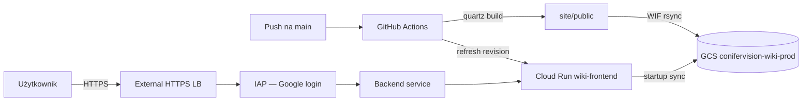

# Prywatna wiki na GCP (GCS + HTTPS LB + IAP)

Wiki Quartz jest publikowana **wyłącznie** pod:

**https://wiki.conifervision.com**

Dostęp chroniony **Identity-Aware Proxy (IAP)** — logowanie kontem Google (`@conifervision.com`). Czytelnicy **nie** potrzebują dostępu do Google Cloud Console.

## Architektura



**Uwaga:** IAP nie wspiera backend bucket w `gcloud` — statyka jest w **GCS**, a **Cloud Run** (nginx) synchronizuje pliki przy starcie i serwuje je za **backend service** z IAP.

| Zasób | Nazwa / wartość |
|-------|------------------|
| GCP project | `conifer-vision01` |
| Bucket (artefakt CI) | `gs://conifervision-wiki-prod` |
| Region | `europe-central2` |
| Hostname | `wiki.conifervision.com` |
| LB IP | `8.232.255.0` (sprawdź: `gcloud compute addresses describe wiki-lb-ip --global`) |
| Grupa czytelników | `wiki-readers@conifervision.com` |
| SA deploy (CI) | `wiki-deployer@conifer-vision01.iam.gserviceaccount.com` |
| Cloud Run | `wiki-frontend` |
| Backend service (IAP) | `wiki-backend-v2` (aktywny; `wiki-backend-service` — stary, nie używać) |

## Jednorazowy setup GCP

### Opcja A — skrypt (zalecane)

Z katalogu repozytorium (wymaga `gcloud` + uprawnień Owner/Editor):

```bash
chmod +x infra/setup-gcp-wiki.sh
bash infra/setup-gcp-wiki.sh
```

Skrypt jest **idempotentny** — można uruchamiać ponownie.

Na końcu wypisze **IP load balancera** i wartości do GitHub Secrets.

### Opcja B — ręcznie

Patrz komendy w [`infra/setup-gcp-wiki.sh`](../infra/setup-gcp-wiki.sh).

## Cloud Identity Free

Wykonaj w [Google Admin Console](https://admin.google.com) (konto admina domeny):

1. **Zweryfikuj domenę** `conifervision.com` (rekord TXT u registrara DNS).
2. Utwórz grupę **`wiki-readers@conifervision.com`**.
3. Dodaj użytkowników (np. **`manager@conifervision.com`**) do grupy.
4. **Nie** nadawaj tym użytkownikom ról w GCP Console (Viewer/Editor) — wystarczy członkostwo w grupie + IAP accessor (skrypt IAM).

Użytkownik `manager@` loguje się jak do Gmaila/Google — bez konsoli GCP.

## IAP — OAuth consent screen

Przed pierwszym logowaniem (jednorazowo w GCP Console):

1. **APIs & Services → OAuth consent screen**
2. User type: **Internal** (wymaga organizacji z domeną `conifervision.com`)
3. Zapisz domyślne pola (app name np. „Conifervision Wiki”)

Jeśli `gcloud iap web enable` w skrypcie się wyłoży — włącz IAP ręcznie:

1. **Security → Identity-Aware Proxy**
2. Zaznacz **backend service** `wiki-backend-service` → **Turn on IAP**
3. Dodaj principal: `wiki-readers@conifervision.com` → rola **IAP-secured Web App User**

Lub:

```bash
gcloud compute backend-services update wiki-backend-service \
  --project=conifer-vision01 \
  --global \
  --iap=enabled

gcloud iap web add-iam-policy-binding \
  --project=conifer-vision01 \
  --resource-type=backend-services \
  --service=wiki-backend-service \
  --member='group:wiki-readers@conifervision.com' \
  --role='roles/iap.httpsResourceAccessor'
```

## DNS

U registrara domeny `conifervision.com`:

| Typ | Nazwa | Wartość |
|-----|-------|---------|
| **A** | `wiki` | IP z outputu skryptu (`gcloud compute addresses describe wiki-lb-ip --global --format='value(address)'`) |

Certyfikat managed SSL provisioning: **15–60 min** po poprawnym DNS.

Status certyfikatu:

```bash
gcloud compute ssl-certificates describe wiki-ssl-cert --global \
  --format='yaml(managed.status,managed.domainStatus)'
```

## GitHub Actions — Workload Identity Federation

**Bez kluczy JSON** w repozytorium.

### Secrets (Settings → Secrets and variables → Actions)

| Secret | Wartość |
|--------|---------|
| `GCP_WORKLOAD_IDENTITY_PROVIDER` | `projects/PROJECT_NUMBER/locations/global/workloadIdentityPools/github-pool/providers/github-provider` |
| `GCP_SERVICE_ACCOUNT` | `wiki-deployer@conifer-vision01.iam.gserviceaccount.com` |

Wartości dla `conifer-vision01` (zweryfikowane):

```
GCP_WORKLOAD_IDENTITY_PROVIDER=projects/433062774397/locations/global/workloadIdentityPools/github-pool/providers/github-provider
GCP_SERVICE_ACCOUNT=wiki-deployer@conifer-vision01.iam.gserviceaccount.com
```

Skrypt (wypisuje aktualne wartości z GCP):

```bash
bash infra/print-github-wiki-secrets.sh
```

`PROJECT_NUMBER`:

```bash
gcloud projects describe conifer-vision01 --format='value(projectNumber)'
```

### Workflow

Plik: [`.github/workflows/deploy-wiki-gcp.yml`](../.github/workflows/deploy-wiki-gcp.yml)

- Trigger: push na `main` lub **workflow_dispatch**
- Build: `conifervision/` → Quartz → `site/public/`
- Deploy: `gcloud storage rsync` do `gs://conifervision-wiki-prod`

## Wyłączenie GitHub Pages (publiczna kopia)

Wiki nie jest publikowana na GitHub Pages. Wyłącz starą stronę:

```bash
./scripts/disable-github-pages.sh
```

Lub: [Settings → Pages](https://github.com/kris1pl/ai-research-forestry/settings/pages) → **Unpublish site**.

Po wyłączeniu `https://kris1pl.github.io/ai-research-forestry/` zwraca **404**.

## Troubleshooting

| Problem | Przyczyna | Rozwiązanie |
|---------|-----------|-------------|
| **ERR_CONNECTION_CLOSED** / **502** + `Empty Google Account OAuth client ID` | IAP włączone bez OAuth client | Wyłącz IAP lub skonfiguruj OAuth w Console (poniżej) |
| **SSL FAILED_NOT_VISIBLE** | Cert utworzony przed poprawnym DNS | Utwórz nowy cert (`wiki-ssl-cert-v2`) po ustawieniu rekordu A |
| **Pusta wiki** / GCS sync fail | `wiki-runtime` bez `buckets.get` | Dodaj `roles/storage.legacyBucketReader` na bucket |
| **403 IAP** po logowaniu | Brak roli accessor | Dodaj usera do `wiki-readers@…` + IAM binding IAP |
| **403** bez logowania | OK — IAP działa | Zaloguj się kontem `@conifervision.com` |
| **Certyfikat nieaktywny** | DNS | Sprawdź rekord A `wiki` → IP LB |
| **Pusta strona / 404** | Pusty bucket | Uruchom workflow deploy lub `gcloud storage rsync` ręcznie |
| **RSS/XML zamiast HTML** | Brak treści w buildzie | Sprawdź kopię `conifervision` → `site/content` |
| **Złe linki w wiki** | `baseUrl` | W `site/quartz.config.ts` musi być `wiki.conifervision.com` |
| **Workflow auth fail** (`Authenticate to Google Cloud`) | Brak lub złe secrets w GitHub | Uruchom `bash infra/print-github-wiki-secrets.sh`, dodaj oba secrety w Settings → Actions, **Re-run workflow** |
| **Workflow auth fail** | Złe WIF secrets | Porównaj provider path i SA z outputem skryptu; WIF na GCP jest OK jeśli `setup-gcp-wiki.sh` przeszedł |
| **Grupa nie istnieje** | Admin | Utwórz `wiki-readers@…` w Google Admin przed IAP binding |

### Ręczny deploy (test)

```bash
make build-wiki-docker   # lub make build-wiki
gcloud storage rsync -r --delete-unmatched-destination-objects \
  site/public gs://conifervision-wiki-prod
```

### Włączenie IAP (Console — wymagane dla projektu bez GCP Organization)

Projekt `conifer-vision01` **nie jest** w GCP Organization — `gcloud iap oauth-brands` nie zadziała. IAP włącz **ręcznie**:

1. [OAuth consent screen](https://console.cloud.google.com/apis/credentials/consent?project=conifer-vision01) → **External** (lub Internal jeśli masz organizację z domeną)
2. [Identity-Aware Proxy](https://console.cloud.google.com/security/iap?project=conifer-vision01) → zasób **`wiki-backend-v2`** → **Turn on IAP** (Console utworzy OAuth client)
3. Dodaj `wiki-readers@conifervision.com` jako **IAP-secured Web App User**
4. Sprawdź:

```bash
curl -sI https://wiki.conifervision.com/
# Oczekiwane po IAP: 302/401/403 — nie 200 bez logowania
```

**Nie włączaj IAP** komendą `--iap=enabled` bez `oauth2-client-id` i `oauth2-client-secret` — powoduje 502.

### Test IAP

```bash
curl -I "https://wiki.conifervision.com"
# Po IAP: 302/401/403 — nie bezpośredni 200 z HTML bez sesji
```

## Koszt (orientacyjny)

| Składnik | Szacunek |
|----------|----------|
| External Application Load Balancer | ~18 USD/mies. + ruch |
| GCS (mała statyczna wiki) | < 1 USD/mies. |
| IAP | bez opłaty per user |
| Cloud Identity Free | 0 USD (w limicie użytkowników) |

## Testy akceptacyjne

- [ ] DNS `wiki.conifervision.com` → IP LB
- [ ] Certyfikat SSL: `ACTIVE`
- [ ] Incognito → przekierowanie do logowania Google
- [ ] `manager@conifervision.com` → strona wiki (HTML)
- [ ] Użytkownik spoza grupy → 403
- [ ] Push na `main` → zielony workflow → zmiana treści po zalogowaniu
